# 📚 Enhanced RAG PDF Chat - LangChain Powered Document AI

<div align="center">


*Transform your PDFs into intelligent, conversational experiences with advanced AI*

[🚀 Quick Start](#-quick-start) • [✨ Features](#-features) • [🏗️ Architecture](#️-architecture) • [📖 Documentation]([#-documentation](https://github.com/SaktiSriraj/pdf-knowledge-extractor/wiki/%F0%9F%93%9A-Enhanced-RAG-PDF-Chat-%E2%80%90-Documentation))

</div>

---

## 🌟 Overview

Enhanced RAG PDF Chat is a sophisticated document intelligence application that combines the power of **LangChain**, **FAISS vector search**, and **DeepSeek R1** AI model to create an intuitive chat interface for your PDF documents. Upload documents or provide URLs, and engage in natural conversations to extract insights, summaries, and detailed analysis.

### 🎯 Key Highlights

- **🧠 Advanced LangChain Integration**: Multi-strategy text processing with intent-based query analysis
- **🚀 Real-time Processing**: Live progress tracking with animated document processing
- **🔍 Intelligent Retrieval**: FAISS-powered similarity search with contextual compression
- **💬 Natural Conversations**: Context-aware responses with conversation memory
- **🎨 Beautiful UI**: Modern Streamlit interface with gradient styling and animations
- **🔒 Privacy First**: Process documents locally with secure API integration

---

## ✨ Features

### 📄 **Document Processing**
- **Multi-format Support**: PDF upload and URL-based document ingestion
- **Advanced Text Splitting**: Recursive, token-based, and semantic chunking strategies
- **Metadata Enrichment**: Comprehensive document indexing with source tracking
- **Real-time Progress**: Animated processing pipeline with step-by-step feedback

### 🤖 **AI-Powered Interactions**
- **Intent Recognition**: Automatic query classification (summary, analysis, comparison, explanation)
- **Contextual Responses**: LangChain-powered prompt engineering for accurate answers
- **Source Attribution**: Transparent citations with relevance scoring
- **Conversation Memory**: Maintains context across multiple exchanges

### 🔍 **Advanced Retrieval**
- **Multiple Search Strategies**: Similarity, MMR, and score-based threshold filtering
- **Contextual Compression**: Intelligent content ranking and filtering
- **Performance Optimization**: Cached embeddings and parallel processing
- **Quality Metrics**: Relevance scoring and chunk optimization

### 🎨 **User Experience**
- **Responsive Design**: Mobile-friendly interface with gradient styling
- **Real-time Animations**: Loading spinners, progress bars, and smooth transitions
- **Interactive Elements**: Expandable source references and processing statistics
- **Clean Architecture**: Modular design with clear separation of concerns

---

## 🏗️ Architecture

```mermaid
graph TB
    A[📄 Document Input] --> B[🔄 LangChain Processor]
    B --> C[✂️ Advanced Text Splitting]
    C --> D[🧠 Sentence Transformers]
    D --> E[📊 FAISS Vector Index]
    
    F[💬 User Query] --> G[🎯 Intent Analysis]
    G --> H[🔍 Multi-Strategy Retrieval]
    H --> E
    E --> I[📝 Context Assembly]
    I --> J[🤖 DeepSeek R1 API]
    J --> K[✨ Enhanced Response]
    
    style A fill:#e1f5fe, color:#000000
    style E fill:#f3e5f5, color:#000000
    style J fill:#e8f5e8, color:#000000
    style K fill:#fff3e0, color:#000000
```



### 🧩 Core Components

| Component           | Technology                     | Purpose                                     |
| ------------------- | ------------------------------ | ------------------------------------------- |
| **Document Loader** | LangChain + PyMuPDF            | Advanced PDF processing and text extraction |
| **Text Splitter**   | RecursiveCharacterTextSplitter | Intelligent document chunking with overlap  |
| **Embeddings**      | Sentence Transformers          | High-quality vector representations         |
| **Vector Store**    | FAISS                          | Efficient similarity search and retrieval   |
| **LLM Integration** | OpenRouter + DeepSeek R1       | Powerful language model for responses       |
| **UI Framework**    | Streamlit                      | Interactive web interface                   |

---

## 🚀 Quick Start

### 📋 Prerequisites

- **Python 3.8+**
- **OpenRouter API Key** (free at [openrouter.ai](https://openrouter.ai))

### ⚡ Installation

1. **Clone the Repository**
   ```bash
   git clone https://github.com/saktisriraj/pdf-knowledge-extractor.git
   cd pdf-knowledge-extractor
   ```

2. **Set Up Environment**
   ```bash
   python -m venv venv
   
   # Windows
   venv\Scripts\activate
   
   # macOS/Linux
   source venv/bin/activate
   ```

3. **Install Dependencies**
   ```bash
   pip install -r requirements.txt
   ```

4. **Configure API Key**
   ```bash
   # Create .env file
   echo "OPENROUTER_API_KEY=your_api_key_here" > .env
   ```

5. **Initialize Models**
   ```bash
   python install_enhanced.py
   ```

6. **Launch Application**
   ```bash
   streamlit run app.py
   ```

### 🌐 Access the App

Open your browser and navigate to `http://localhost:8501`

---

## 📖 Usage Guide

### 📤 **Document Upload**

1. **File Upload**: Drag and drop PDF files or use the file picker
2. **URL Import**: Paste direct links to PDF documents
3. **Processing**: Watch real-time progress with animated feedback
4. **Verification**: Confirm successful indexing with processing statistics

### 💬 **Chat Interface**

1. **Natural Queries**: Ask questions in plain English
2. **Intent Recognition**: System automatically optimizes response strategy
3. **Source References**: Expand to view relevant document sections
4. **Conversation Flow**: Maintain context across multiple questions

### 🔧 **Advanced Features**

- **Query Types**: Summaries, analysis, comparisons, explanations
- **Source Filtering**: Focus on specific documents or sections
- **Export Options**: Save conversations and insights
- **Performance Metrics**: Monitor processing speed and accuracy

---

## 🛠️ Configuration

### 🎛️ **Environment Variables**

```bash
# API Configuration
OPENROUTER_API_KEY=your_key_here
OPENROUTER_MODEL=deepseek/deepseek-r1-0528:free
SITE_URL=http://localhost:8501
SITE_NAME=Enhanced RAG PDF Chat

# LangChain Settings
LANGCHAIN_CHUNK_SIZE=600
LANGCHAIN_CHUNK_OVERLAP=100
LANGCHAIN_MODEL_TEMPERATURE=0.7
LANGCHAIN_MAX_TOKENS=2000

# Processing Parameters
CHUNK_SIZE=500
CHUNK_OVERLAP=50
TOP_K=5
```

### ⚙️ **Customization Options**

- **Text Splitting Strategies**: Recursive, token-based, semantic, hybrid
- **Retrieval Methods**: Similarity, MMR, score-based threshold
- **Response Styles**: Technical, conversational, analytical
- **UI Themes**: Gradient styling, color schemes, animations

---

## 📊 Performance & Metrics

### 🚀 **Processing Speed**
- **Document Indexing**: ~2-5 seconds per PDF
- **Query Response**: ~1-3 seconds average
- **Embedding Generation**: Optimized batch processing
- **Vector Search**: Sub-second similarity retrieval

### 💾 **Resource Usage**
- **CPU Only**: No GPU requirements
- **Memory**: ~500MB-2GB depending on document size
- **Storage**: Efficient FAISS indexing with compression
- **Network**: Minimal API calls to OpenRouter

### 📈 **Scalability**
- **Document Limit**: Tested with 100+ PDFs
- **Concurrent Users**: Single-user Streamlit deployment
- **Index Size**: FAISS handles millions of vectors efficiently
- **Response Quality**: Maintains accuracy with large document sets

---

## 🏆 Project Highlights

### 🎓 **Technical Excellence**
- **Modern AI Stack**: LangChain + FAISS + Transformers integration
- **Production Ready**: Error handling, logging, and performance optimization
- **Clean Architecture**: Modular design with clear separation of concerns
- **Documentation**: Comprehensive code comments and user guides

### 💼 **Professional Features**
- **Enterprise UI**: Polished interface with gradient styling and animations
- **Advanced RAG**: Multi-strategy retrieval with contextual compression
- **Performance Monitoring**: Real-time metrics and processing statistics
- **Extensible Design**: Easy integration of new models and features

### 🔬 **Innovation**
- **Intent-Based Processing**: Automatic query classification and optimization
- **Real-time Feedback**: Live progress tracking with animated visualizations
- **Hybrid Retrieval**: Combines multiple search strategies for optimal results
- **Context Awareness**: Maintains conversation flow and document relationships

---

## 🤝 Contributing

We welcome contributions! Please see our [Contributing Guidelines](CONTRIBUTING.md) for details.

### 🐛 **Bug Reports**
- Use GitHub Issues with detailed descriptions
- Include error logs and reproduction steps
- Specify environment details and configuration

### ✨ **Feature Requests**
- Propose new features with clear use cases
- Discuss implementation approaches
- Consider backward compatibility

### 🔧 **Development Setup**
```bash
# Install development dependencies
pip install -r requirements-dev.txt

# Run tests
python -m pytest tests/

# Code formatting
black app.py
isort app.py
```

---

## 📄 License

This project is licensed under the MIT License - see the [LICENSE](LICENSE) file for details.

---

## 🙏 Acknowledgments

- **[LangChain](https://github.com/langchain-ai/langchain)** - Advanced document processing framework
- **[FAISS](https://github.com/facebookresearch/faiss)** - Efficient vector similarity search
- **[Sentence Transformers](https://github.com/UKPLab/sentence-transformers)** - High-quality embeddings
- **[Streamlit](https://github.com/streamlit/streamlit)** - Beautiful web application framework
- **[OpenRouter](https://openrouter.ai)** - Unified API access to language models

---

## 📞 Support

- **📧 Email**: [dev.saktisriraj@domain.com](mailto:dev.saktisrirajl@domain.com)
- **💬 Discussions**: [GitHub Discussions](https://github.com/saktisriraj/pdf-knowledge-extractor/discussions)
- **🐛 Issues**: [GitHub Issues](https://github.com/saktisriraj/pdf-knowledge-extractor/issues)
- **📖 Documentation**: [Wiki]([https://github.com/saktisriraj/pdf-knowledge-extractor/wiki](https://github.com/SaktiSriraj/pdf-knowledge-extractor/wiki/%F0%9F%93%9A-Enhanced-RAG-PDF-Chat-%E2%80%90-Documentation))

---

<div align="center">

**⭐ Star this repository if you find it helpful!**

*Built with ❤️ by [Sakti Sriraj](https://github.com/saktisriraj)*

</div>
